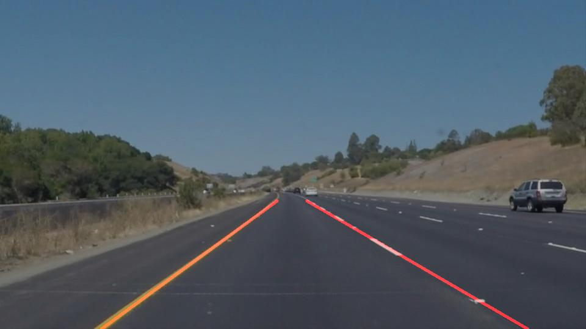

# **Finding Lane Lines on the Road** 

## Writeup for Project One

**Finding Lane Lines on the Road**
---
Two main steps of this project are the following:
* Make a pipeline that finds lane lines on the road
* Reflect on your work in a written report

---

**Examples of Output Images**
---

*-- line segementions example*

*-- solid line example*
**Examples of Output Videos**
---

**Reflection**
---
### 1. Pipeline.
My pipeline consisted of the following steps:
1. Set up necessary parameters for the helper functions
2. Read original image using `mpimg.imread`
3. Convert RGB image to grayscale image
4. Apply gaussian blur on the grayscale image
5. Apply Canny detection to find edges
6. Using a rectangle polygan mask to obtain the ROI. The edges outside ROI are set to black, only edges inside ROI are retained
7. Apply hough transformation on masked edges
8. Draw lines on top of the lines detected by hough transform
9. Save and/or display result

**Notes**:
---
+ In order to draw a extended(solid) line on the detected line segments, I modified the draw_lines() function by the following steps:
    1. Calculate Slope and Y-axis-intersection of each line segment
    2. Identify if the detected line segments are on left or right lanes, based on their slope.
    3. Store segments' parameters
    4. Calculate average of parameters for left and right
    5. Using the averaged parameters calculate averaged/extened left and right lines
    6. Draw the averaged lines
+ Acounding to the feedback from first submission, i have adjusted the value of low and high thresholds of canny detector as well as the `min_line_len` and `max_line_gap` for hough transform to reduce noises. Additionally, i have reduce the lines by seting ranges of the slopes for left and right lane to filter out outliers. 

### 2. Potential shortcomings

- Don't work well on "challenge.mp4". Having trouble handling curves.
- Sometimes because of the video frames the detected/painted results are unstable

### 3. Suggest possible improvements

- Improve to handle curves. Possible approaches:
    - RANSAC with Hough lines
    - Fitline() from Opencv
- Average current detected lines with resutls of previous frames to improve the stability 
